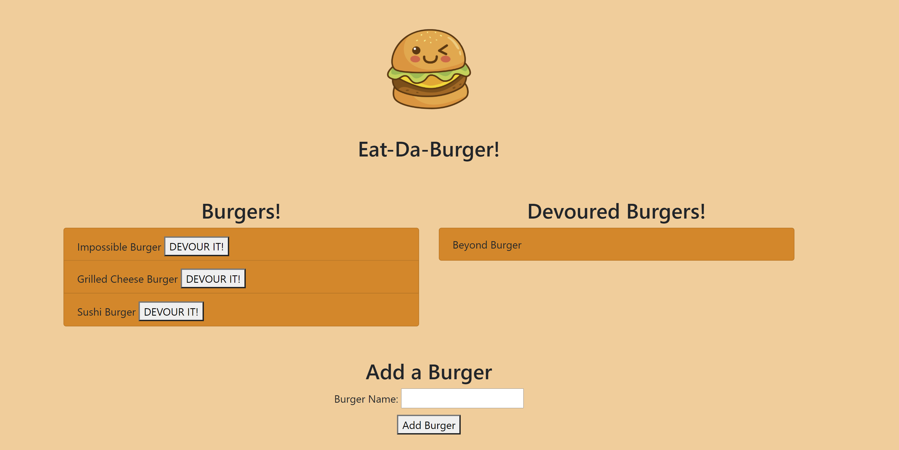

# Burger

## Description

Burger is a node application that allows a user to create a list of burgers they plan to eat, and list of burgers that they have already eaten. The user can add the burger they plan to eat by clicking the add burget button. Once, the user has their list they can then click on devour it! to move it to the devour list!

## Table of contents

- [Description](#Description)
- [Installation](#Installation)
- [Usage](#Usage)
- [License](#License)
- [Contributors](#Contributors)
- [Test](#Test)
- [GitHub Info](#Questions)

## Installation

Install the depencies in the package.json:

```
npm install

```

Then run the application:

```
npm start

```

## Usage

Screenschot



## License


## Contributors

No contributing guidelines

## Test

No test required

## Questions

For questions contact ooledezma@gmail.com.
GitHub URL: https://api.github.com/users/ooledezma
